# data-harvester Architecture

This document provides a comprehensive overview of the data-harvester architecture using diagrams and detailed explanations.

## Table of Contents
- [System Architecture Overview](#system-architecture-overview)
- [Data Flow](#data-flow)
- [Component Interaction](#component-interaction)
- [Plugin System](#plugin-system)
- [ML/NLP Pipeline](#mlnlp-pipeline)
- [Configuration Management](#configuration-management)
- [Core Components](#core-components)

---

## System Architecture Overview

The following diagram shows the high-level architecture of data-harvester:

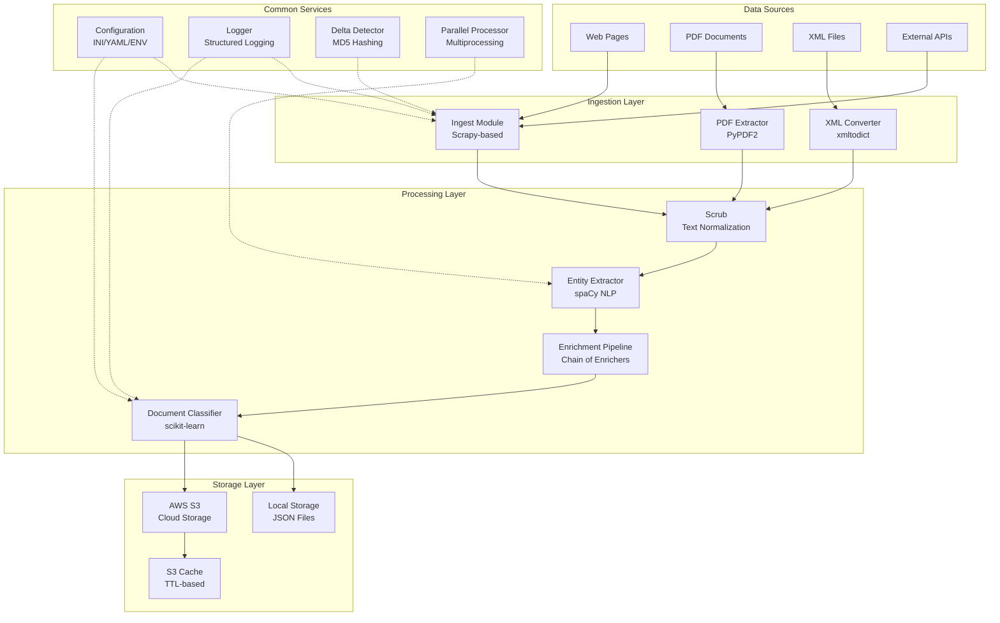

---

## Data Flow

This diagram illustrates how data flows through the system from ingestion to storage:

```mermaid
flowchart LR
    subgraph INPUT["Input Stage"]
        direction TB
        A1[Web Scraping]
        A2[PDF Upload]
        A3[XML Import]
    end

    subgraph VALIDATE["Validation Stage"]
        direction TB
        B1[URL Validation]
        B2[Schema Validation]
        B3[Required Fields Check]
    end

    subgraph TRANSFORM["Transform Stage"]
        direction TB
        C1[HTML Tag Removal]
        C2[Whitespace Normalization]
        C3[Text Cleaning]
    end

    subgraph EXTRACT["Extraction Stage"]
        direction TB
        D1[Entity Extraction]
        D2[Metadata Extraction]
        D3[Content Parsing]
    end

    subgraph ENRICH["Enrichment Stage"]
        direction TB
        E1[Custom Enrichers]
        E2[Data Augmentation]
        E3[Cross-referencing]
    end

    subgraph CLASSIFY["Classification Stage"]
        direction TB
        F1[TF-IDF Vectorization]
        F2[Model Prediction]
        F3[Confidence Scoring]
    end

    subgraph OUTPUT["Output Stage"]
        direction TB
        G1[JSON Export]
        G2[S3 Upload]
        G3[DataFrame Output]
    end

    INPUT --> VALIDATE --> TRANSFORM --> EXTRACT --> ENRICH --> CLASSIFY --> OUTPUT
```

---

## Component Interaction

Detailed view of how modules interact with each other:

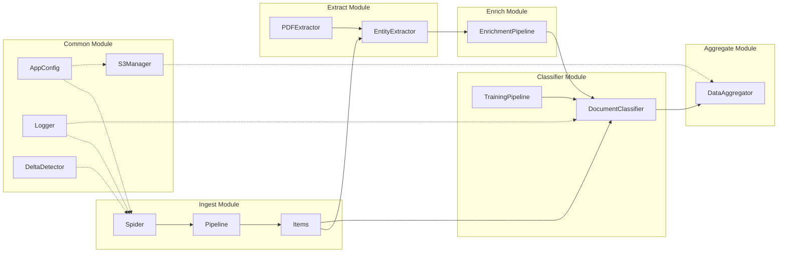

---

## Plugin System

The extensible plugin architecture:

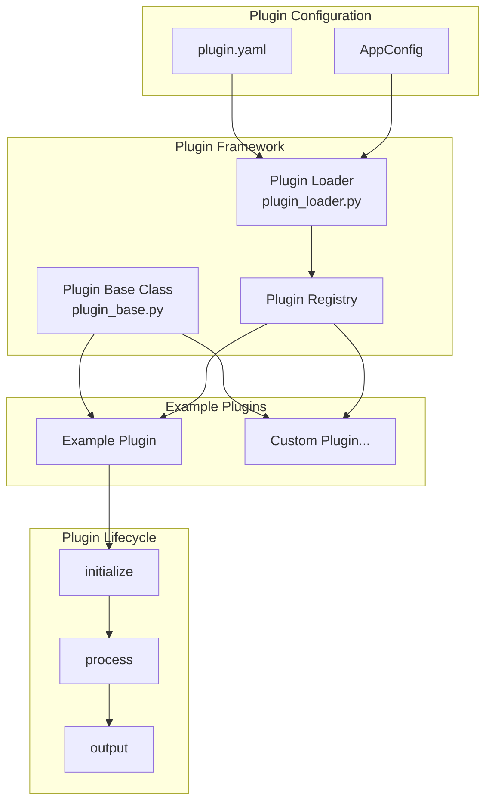

### Plugin Development Flow

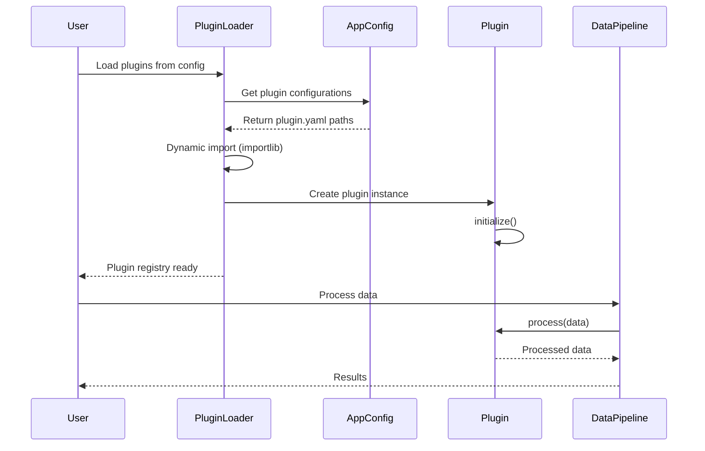

---

## ML/NLP Pipeline

### Document Classification Flow

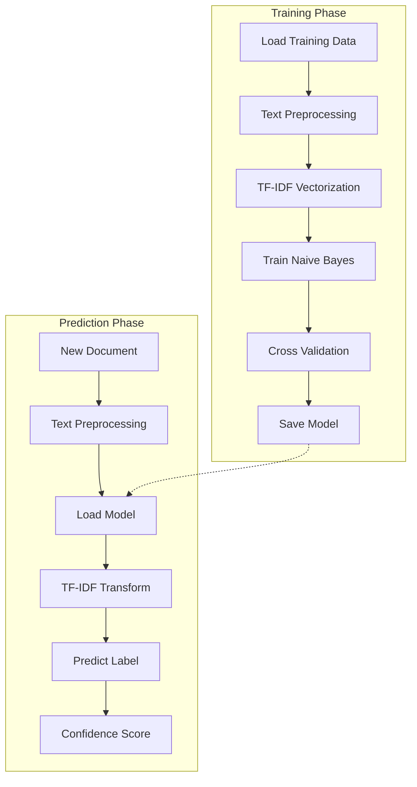

### Entity Extraction Pipeline

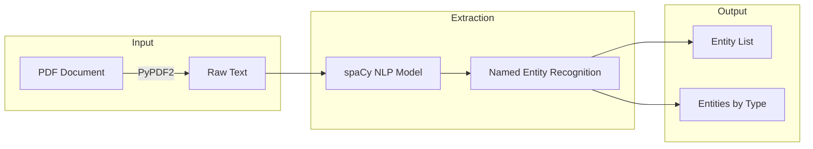

### Training Pipeline Sequence

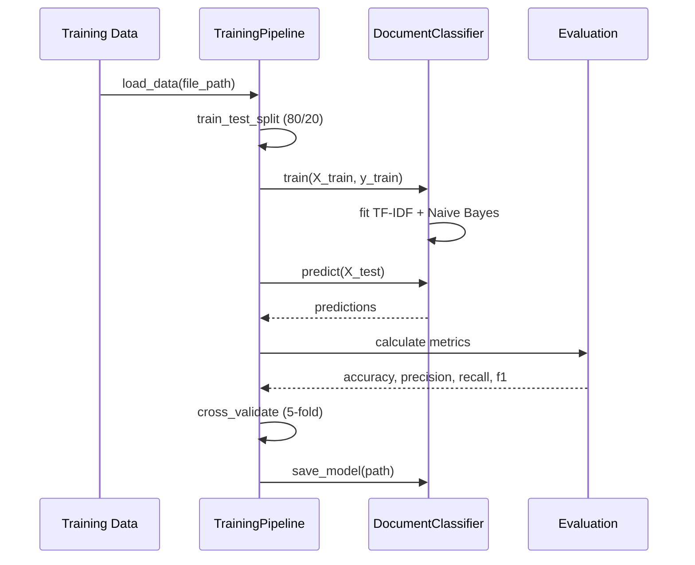

---

## Configuration Management

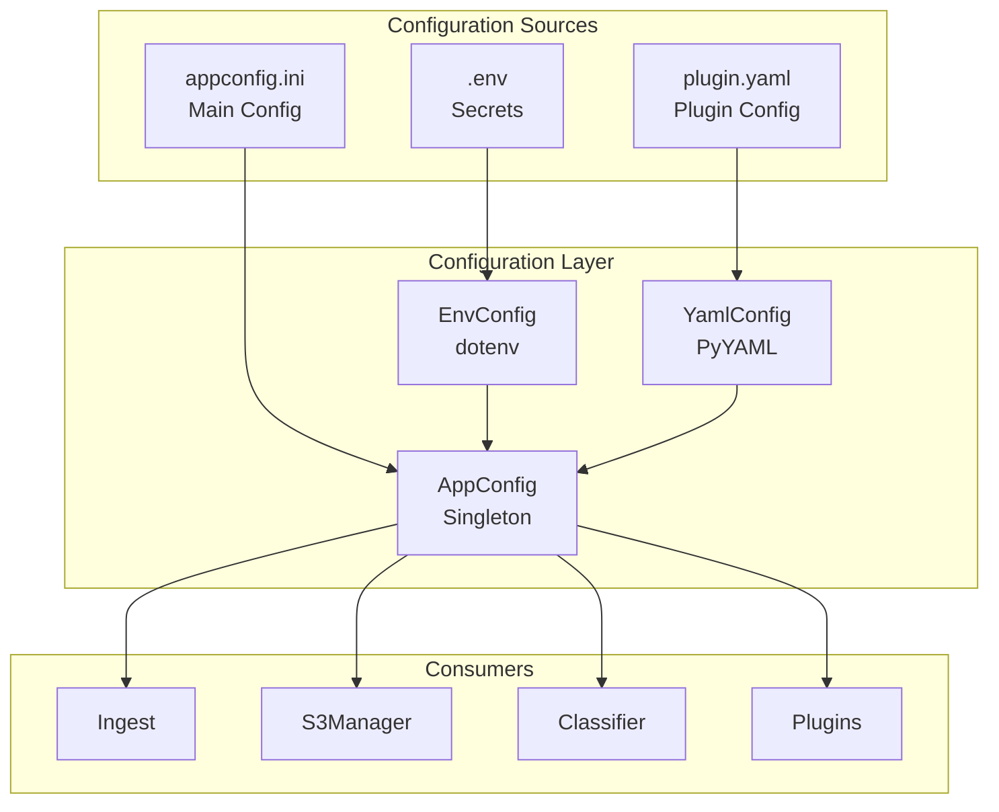

### Configuration Loading Sequence

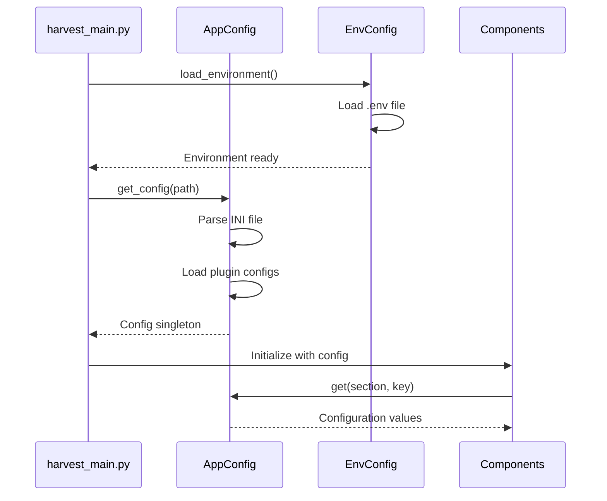

---

## Core Components

### 1. Common Utilities
- **Configuration management** - INI, YAML, and environment variable support
- **Logging** - Structured logging with console and file handlers
- **S3 operations** - Upload, download, list, and cache S3 objects
- **File utilities** - MD5 hashing and delta detection

### 2. Data Processing
- **JSON/XML converters** - Format transformation utilities
- **Text cleaning** - HTML removal, whitespace normalization
- **Delta detection** - Track file changes using MD5 hashing
- **Aggregation** - Combine data from multiple sources

### 3. ML/NLP
- **Classification** - scikit-learn based document classification
- **Entity extraction** - spaCy Named Entity Recognition
- **Training pipelines** - Model training and evaluation workflows

### 4. Web Scraping
- **Scrapy integration** - Configurable web crawling
- **Middleware** - Request/response processing
- **Pipelines** - Item validation and processing

### 5. Plugin System
- **Plugin loader** - Dynamic plugin loading from YAML config
- **Plugin base class** - Abstract base for custom plugins
- **Example plugins** - Reference implementations

---

## Processing Pseudocode

### Main Harvest Process

```
FUNCTION harvest_data(config_path, process_id):
    # Initialize
    config = load_config(config_path)
    logger = setup_logger(config)

    # Load plugins if configured
    plugins = load_plugins(config)

    # Initialize components
    ingest = initialize_ingest(config)
    extractor = EntityExtractor()
    classifier = DocumentClassifier()

    # Load pre-trained model if exists
    IF model_exists(config.model_path):
        classifier.load_model(config.model_path)

    # Main processing loop
    FOR source IN config.sources:
        # Crawl/fetch data
        raw_data = ingest.crawl(source)

        # Check for changes
        IF delta_detector.has_changed(raw_data):
            # Clean text
            cleaned = scrub.normalize_text(raw_data)

            # Extract entities
            entities = extractor.extract_entities(cleaned)

            # Apply enrichers
            FOR enricher IN enrichment_pipeline:
                cleaned = enricher.enrich(cleaned)

            # Classify document
            label = classifier.predict(cleaned)

            # Apply plugin processing
            FOR plugin IN plugins:
                cleaned = plugin.process(cleaned)

            # Store results
            IF config.use_s3:
                s3_manager.upload(cleaned)
            ELSE:
                save_to_local(cleaned)

    RETURN success
```

### Batch Processing with Parallelization

```
FUNCTION process_batch(items, processor_func):
    # Determine worker count
    num_workers = min(cpu_count(), len(items))

    # Create process pool
    WITH ProcessPoolExecutor(num_workers) AS pool:
        # Map function across items
        results = pool.map(processor_func, items)

    RETURN list(results)
```

---

## Deployment Architecture

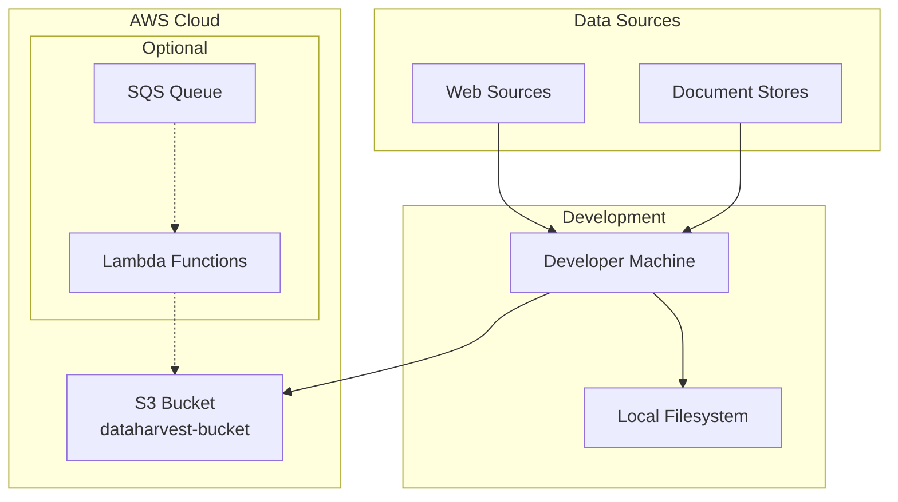

---

## Error Handling Flow

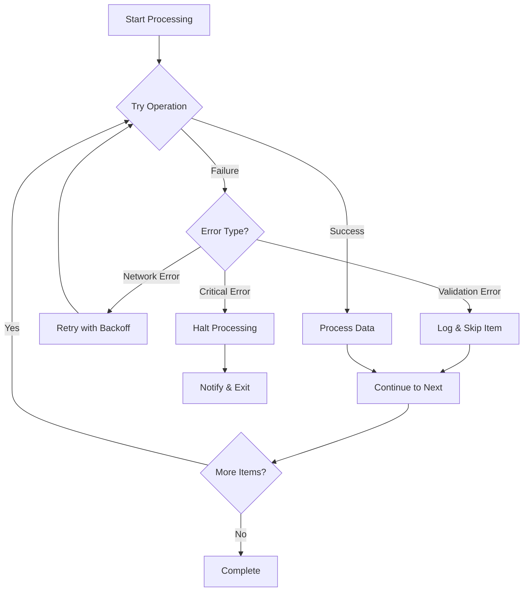

---

## Summary

data-harvester follows these architectural principles:

1. **Modularity** - Each component handles a specific concern
2. **Extensibility** - Plugin architecture for custom functionality
3. **Scalability** - Parallel processing and cloud storage support
4. **Configurability** - Multiple configuration sources (INI, YAML, ENV)
5. **Observability** - Structured logging throughout the system
